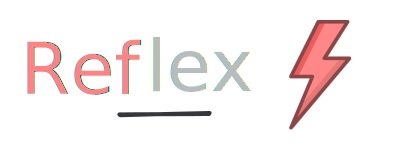
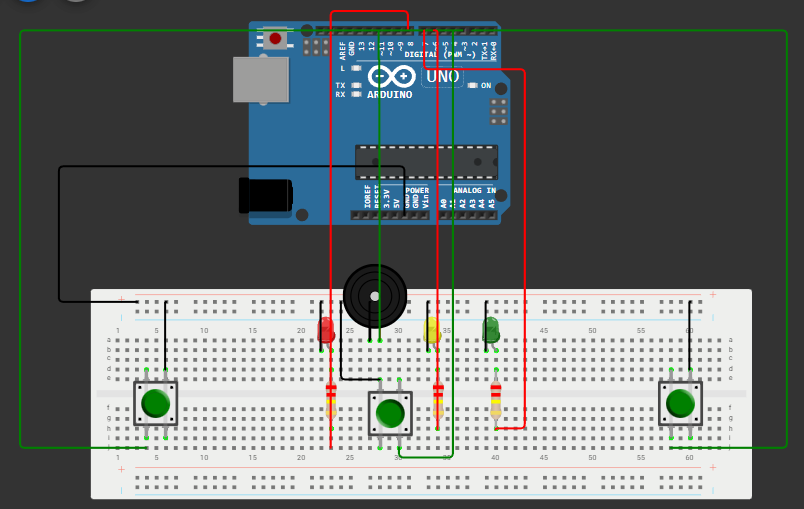

  

  
  
  
  

---

  <strong>Reflex</strong> es un juego de reflejos para dos jugadores desarrollado con Arduino.

  El sistema utiliza una secuencia visual y sonora para preparar la partida, genera señales falsas para evitar respuestas anticipadas y detecta qué jugador reacciona primero ante la señal real.

## Funcionalidades

<table>
  <tr>
    <td><strong>Inicio controlado</strong></td>
    <td>La partida comienza mediante un botón central.</td>
  </tr>
  <tr>
    <td><strong>Preparación visual y sonora</strong></td>
    <td>El sistema guía la partida usando LEDs y buzzer.</td>
  </tr>
  <tr>
    <td><strong>Señales falsas</strong></td>
    <td>Incluye estímulos previos para evitar respuestas anticipadas.</td>
  </tr>
  <tr>
    <td><strong>Detección de reacción</strong></td>
    <td>Registra cuál jugador presiona primero ante la señal real.</td>
  </tr>
  <tr>
    <td><strong>Control de fallos</strong></td>
    <td>Detecta si un jugador se adelanta antes de tiempo.</td>
  </tr>
  <tr>
    <td><strong>Resultado visible</strong></td>
    <td>Indica ganador o fallo mediante LEDs, buzzer y monitor serial.</td>
  </tr>
</table>

## Documentación

<table>
  <tr>
    <td><strong>Proyecto</strong></td>
    <td>Descripción general, objetivo y justificación.</td>
    <td><a href="docs/proyecto.md">docs/proyecto.md</a></td>
  </tr>
  <tr>
    <td><strong>Componentes</strong></td>
    <td>Materiales utilizados y armado del prototipo.</td>
    <td><a href="docs/componentes.md">docs/componentes.md</a></td>
  </tr>
  <tr>
    <td><strong>Lógica</strong></td>
    <td>Funcionamiento del sistema y comportamiento del código.</td>
    <td><a href="docs/logica.md">docs/logica.md</a></td>
  </tr>
  <tr>
    <td><strong>Código fuente</strong></td>
    <td>Archivo principal del proyecto Arduino.</td>
    <td><a href="src/reflex.ino">src/reflex.ino</a></td>
  </tr>
  <tr>
    <td><strong>Diagrama de conexión</strong></td>
    <td>Esquema visual de conexiones físicas.</td>
    <td><a href="docs/img/diagrama-conexion-v2.0.png">diagrama-conexion-v2.0.png</a></td>
  </tr>
  <tr>
    <td><strong>Diagrama de flujo</strong></td>
    <td>Representación de la lógica principal del programa.</td>
    <td><a href="docs/img/diagrama-flujo.png">diagrama-flujo.png</a></td>
  </tr>
  <tr>
    <td><strong>Link a Wokwi</strong></td>
    <td>Simulacion Realizada en Wokwi</td>
    <td><a href="https://wokwi.com/projects/467573832377455617">Ir</a></td>
  </tr>
</table>

## Diagrama de conexión

  

