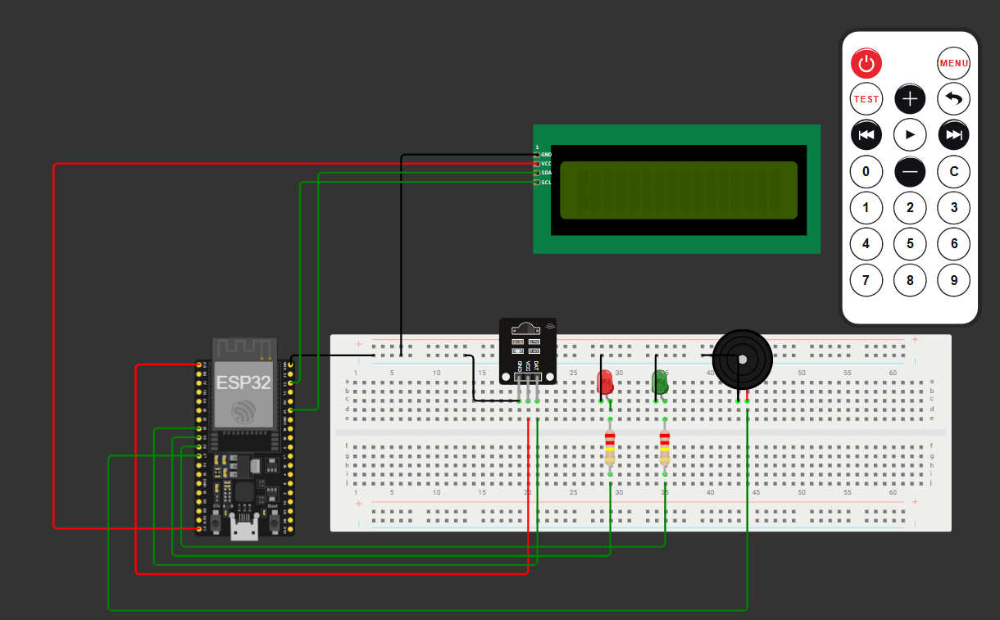

<p align="center">
  
</p>

<p align="center">
  
  
  
  
  
  
  
</p>

---

<p align="center">
  <strong>Reflex</strong> es un juego individual de memoria y reflejos simulado con un ESP32 en Wokwi y controlado mediante un control remoto infrarrojo.
</p>

<p align="center">
  El jugador ingresa su nombre, memoriza secuencias numéricas y supera rondas de dificultad progresiva respondiendo antes de que termine el tiempo. Al finalizar, el ESP32 envía el resultado por HTTPS a una API en Vercel, que lo registra en Supabase; la aplicación web desarrollada con Vue muestra el ranking y las estadísticas.
</p>

## Estructura del proyecto

```text
Reflex/
├── hardware/
│   ├── esp32/Reflex.ino    # Código principal y vigente
│   └── arduino-uno/        # Versión anterior conservada como referencia histórica
├── web/
│   ├── api/                # Funciones de la API desplegada en Vercel
│   └── src/                # Aplicación Vue 3 con Vite
└── docs/                   # Documentación técnica, diagramas e imágenes
```

## Arquitectura

```text
ESP32 en Wokwi ── HTTPS ──→ API en Vercel ──→ Supabase ──→ Aplicación Vue
```

El ESP32 envía los resultados de cada partida a la API. Esta valida los datos y los persiste en Supabase, desde donde la aplicación web los consulta para presentar el rendimiento de los jugadores.

## Funcionalidades

| Funcionalidad | Descripción |
| --- | --- |
| Ingreso del jugador | Permite escribir, corregir y confirmar un nombre de hasta cuatro caracteres mediante el control remoto infrarrojo. |
| Interfaz en LCD | Muestra el nombre, la ronda, la secuencia, el progreso, el tiempo restante y el resultado en una pantalla LCD 16x2 con I2C. |
| Rondas progresivas | Genera secuencias aleatorias con los números 1, 2 y 3; su longitud aumenta de tres a ocho posiciones. |
| Lectura infrarroja | Recibe las respuestas del jugador y los comandos para confirmar el nombre o iniciar una nueva partida. |
| Validación y tiempo | Comprueba cada número ingresado y finaliza la partida ante una respuesta incorrecta o cuando se agota el tiempo. |
| Señales visuales y sonoras | Utiliza los LEDs verde y rojo junto con el buzzer para indicar aciertos y errores. |
| Puntaje y progreso | Otorga 100 puntos por ronda superada y registra las rondas acertadas y la ronda alcanzada. |
| Integración en línea | Conecta el ESP32 a Wi-Fi y envía el resultado mediante HTTPS a la API desplegada en Vercel. |
| Persistencia | La API valida los resultados y los almacena en Supabase. |
| Ranking y estadísticas | La aplicación Vue presenta la última partida, el ranking, el récord y las estadísticas generales. |
| Nueva partida | Permite reiniciar el flujo desde el control remoto después de mostrar y guardar el resultado. |

## Documentación

| Recurso | Contenido | Enlace |
| --- | --- | --- |
| Descripción del proyecto | Objetivo, solución, arquitectura y alcance general. | [Leer la descripción del proyecto](docs/proyecto.md) |
| Componentes | Hardware, conexiones, servicios y librerías utilizados. | [Consultar los componentes](docs/componentes.md) |
| Funcionamiento y lógica | Secuencias, estados, validación, puntaje y envío de resultados. | [Leer el funcionamiento y la lógica](docs/logica.md) |
| Código fuente principal | Implementación vigente para ESP32. | [Ver `hardware/esp32/Reflex.ino`](hardware/esp32/Reflex.ino) |
| Diagrama de conexión | Conexiones del ESP32, LCD, receptor IR, LEDs y buzzer. | [Ver el diagrama de conexión](docs/img/Diagrama-conexion.png) |
| Diagrama de flujo | Recorrido completo del sistema representado con Mermaid. | [Ver el diagrama de flujo](docs/diagrama-flujo.md) |
| Simulación | Simulación realizada en Wokwi. | [Abrir la simulación de Reflex](https://wokwi.com/projects/469231128370292737) |
| Aplicación web | Ranking, récord y estadísticas de las partidas registradas. | [Abrir la aplicación web de Reflex](https://reflex-pied.vercel.app/) |

## Diagrama de conexión

<p align="center">
  
</p>

## Diagrama de flujo

El flujo completo del juego, desde el ingreso del nombre hasta la persistencia del resultado, está documentado en el [diagrama de flujo de Reflex](docs/diagrama-flujo.md).

## Aplicación web

La aplicación web está desarrollada con Vue 3 y Vite. Consulta los resultados almacenados en Supabase y presenta la última partida, el ranking de jugadores, el récord y las estadísticas generales.

<p align="center">
  <a href="https://reflex-pied.vercel.app/"><strong>Abrir la aplicación web de Reflex</strong></a>
</p>
