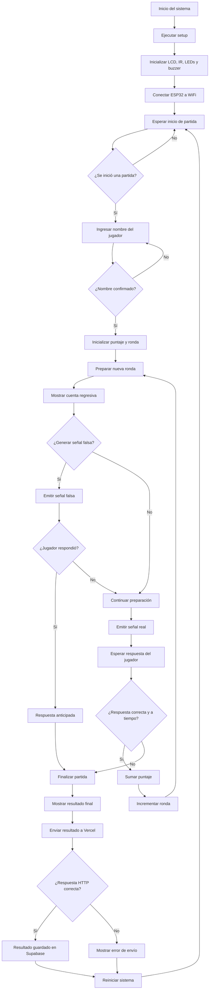

# Diagrama de flujo del sistema Reflex

El siguiente diagrama representa la lógica principal del juego, desde la inicialización del ESP32 hasta el envío del resultado.

```mermaid
flowchart TD
    A[Inicio del sistema] --> B[Ejecutar setup]
    B --> C[Inicializar LCD, IR, LEDs y buzzer]
    C --> D[Conectar ESP32 a WiFi]
    D --> E[Esperar inicio de partida]

    E --> F{¿Se inició una partida?}
    F -- No --> E
    F -- Sí --> G[Ingresar nombre del jugador]

    G --> H{¿Nombre confirmado?}
    H -- No --> G
    H -- Sí --> I[Inicializar puntaje y ronda]

    I --> J[Preparar nueva ronda]
    J --> K[Mostrar cuenta regresiva]
    K --> L{¿Generar señal falsa?}

    L -- Sí --> M[Emitir señal falsa]
    M --> N{¿Jugador respondió?}
    N -- Sí --> O[Respuesta anticipada]
    O --> P[Finalizar partida]
    N -- No --> Q[Continuar preparación]

    L -- No --> Q
    Q --> R[Emitir señal real]
    R --> S[Esperar respuesta del jugador]

    S --> T{¿Respuesta correcta y a tiempo?}
    T -- Sí --> U[Sumar puntaje]
    U --> V[Incrementar ronda]
    V --> J

    T -- No --> P
    P --> W[Mostrar resultado final]
    W --> X[Enviar resultado a Vercel]
    X --> Y{¿Respuesta HTTP correcta?}

    Y -- Sí --> Z[Resultado guardado en Supabase]
    Y -- No --> AA[Mostrar error de envío]

    Z --> AB[Reiniciar sistema]
    AA --> AB
    AB --> E
```